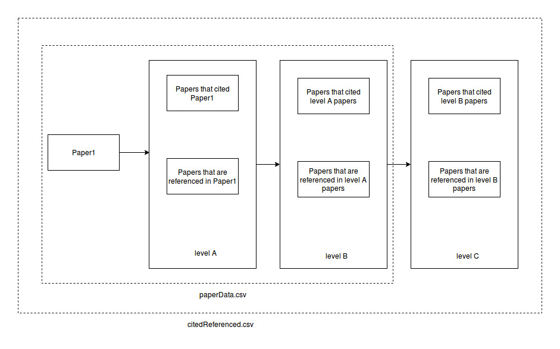
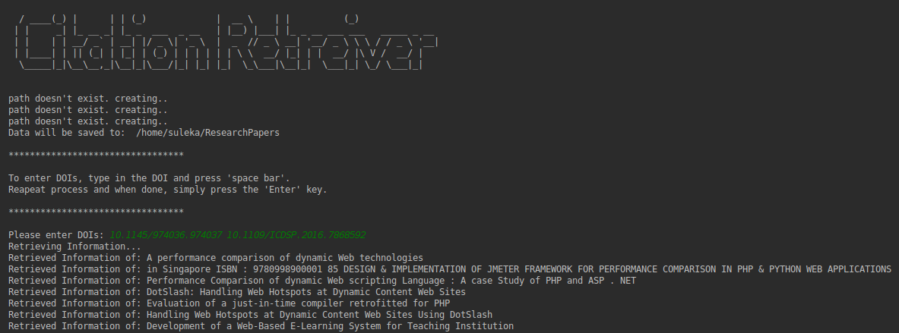

<h1>CitationReferenceRetriever</h1>

A simple application that, when given a paper, retrieves information about papers that cited the concerning paper and also information about the papers that were referenced by the concerning paper. This was done using the [semanticscholar API](http://api.semanticscholar.org/).

You can retrieve citation/reference information of a paper using its:
1. DOI or
2. ArXivId or
3. S2PaperId

Considering one given paper, the application will retrieve papers that have cited this paper and the papers it refers to. We also go one step further to retrieve the citations and references of each cited and referenced paper that was initially obtained. 

Using this information we will be creating 2 different csv files as:<br>
1.citedReferenced.csv<br>
2.paperData.csv

The paperData.csv contains information about the:
1. Base paper
2. The cited and referenced papers of the base paper
3. The cited and referenced papers of each initially cited/referenced papers

The information that paperData.csv contains are:
1. paper id (given by semantic scholar)
2. Title
3. URL
4. Year
5. Venue
6. Citation velocity
7. Influential citation count
8. Total citation count
9. Cited papers (the number of cited papers from all the retrieved papers)

The citedReferenced.csv is the citation graph. It contains the paper id and year of each paper and the paper id and year of the paper that it is cited in.

The retrieved json files will also be saved in a separate folder.

<h2>Folder Structure</h2>

The ResearchPapers folder will be created in your root directory.

````````````````````````````````````
|-- ResearchPapers
|   |-- json
|   |-- papers
|   |   |-- paperData.csv
|   |   |-- citedReferenced.csv

````````````````````````````````````


For further clarifications refer:



<b>Note:</b> The citations and references in level 'C' will not be added to the 'paperData.csv' file but they will be recorded in the citation graph (citedReferenced.csv).

<h2>Dependencies</h2>

* [Requests package](https://pypi.org/project/requests/)

* [Pandas](https://pandas.pydata.org/pandas-docs/stable/install.html)

<b>Note:</b> This program was made using Python version: 3.6.5

<h2>How To Use?</h2>

1. Download python (version 3 or higher)

2. Clone the project

3. Execute the "requirements.txt" file to install the dependencies with the command shown below:
````````````````````````````````````
pip install -r requirements.txt
````````````````````````````````````
4. Run the programe and enter DOIs of the papers when prompted



<h2>Data Representation</h2>

Information about all the cited/referenced papers (citedReferenced.csv) will be in the following format:

| Paper | Cited Paper|
| :---: | :---: |
|5db8bc966b2cd73541ae2f7a71e7d3c6ac59b9a2 - 1998 |  c104608ff97615bbcd54d70573ea3f838d1e5457  - 2002 |

Information about the evaluated papers (paperData.csv) will be in the following format:

| Paper Id | Title | URL | Year | Venue | CitationVelocity | InfluentialCitationCount | TotalCitationCount | Cited Papers |
| :---: | :---: | :---: | :---: | :---: | :---: | :---: | :---: | :---: | 
| 5db8bc966b2cd73541ae2f7a71e7d3c6ac59b9a2 | Evaluation of a just-in-time compiler retrofitted for PHP | https://www.semanticscholar.org/paper/5db8bc966b2cd73541ae2f7a71e7d3c6ac59b9a2 | 2010 | VEE | 0 | 0 | 5 | 23 |
